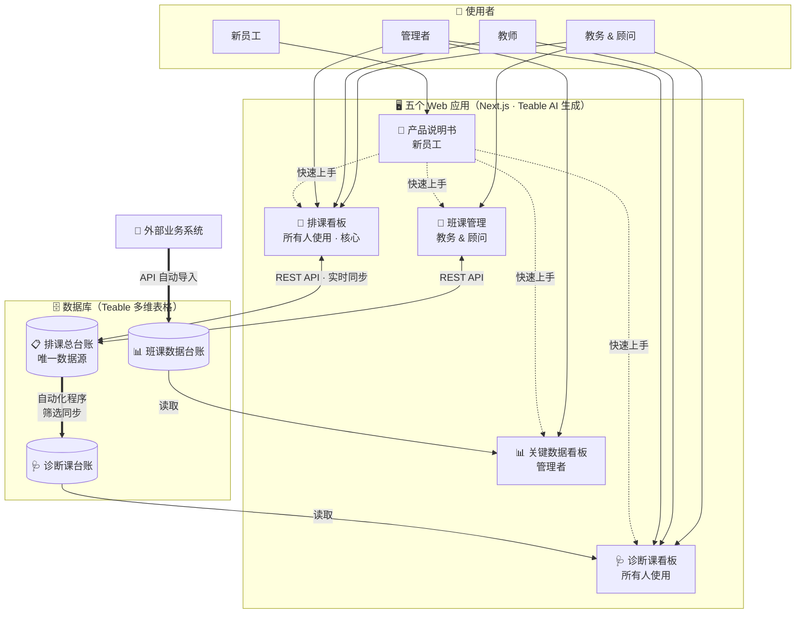
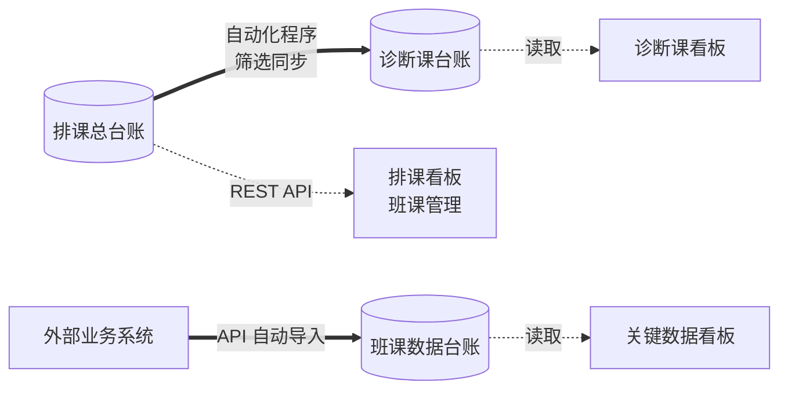
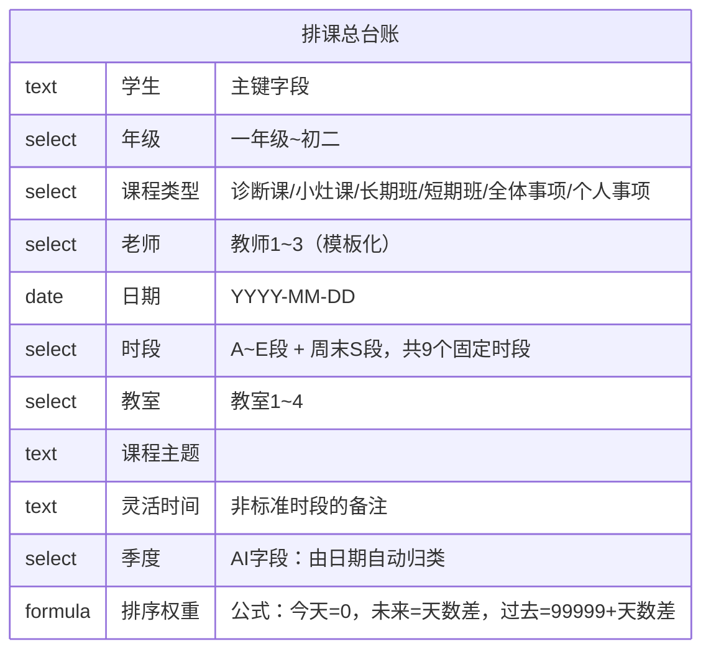
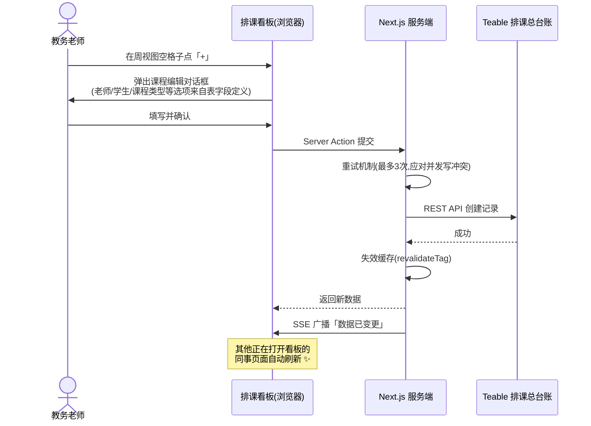
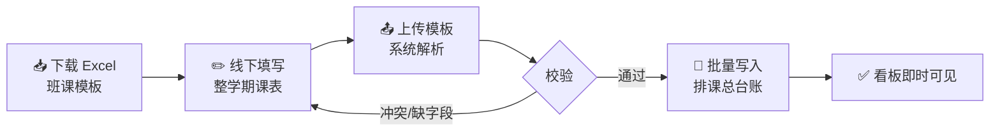

# 校区排课系统（Teable + AI Coding 应用）

> 一个由非程序员通过 **Teable 多维表格 + AI Coding 应用** 搭建的教培机构排课管理系统。
> 本仓库主要展示 **产品设计思路、系统架构与流程设计**，源码由 Teable AI 生成、经人工迭代打磨。

🔗 **[点此查看交互式演示页面](https://edendong1202.github.io/class-scheduling-system/)** （已开启 GitHub Pages，可直接访问）

---

## ✨ 这是什么？

教培分校的日常痛点：**排课靠 Excel + 微信群通知，教室冲突、教师撞档、查询课程全靠校区教务核对。**

我的解法：用 Teable 多维表格作为**数据库底座（Single Source of Truth）**，在它之上生成 5 个各司其职的 Web 应用：

| 应用 | 使用者 | 定位 | 核心功能 |
|------|--------|------|----------|
| 📅 **排课看板** (v10) | 所有人（核心） | 教务日常操作台 | 时间轴周视图（教室 × 时段）、点卡片编辑/删除、多端实时同步、新手引导 |
| 🏫 **班课管理** (v1) | 教务 & 顾问 | 批量排课工具 | 按班级/学期批量创建课程、右键复制课程、Excel 模板导入 |
| 🩺 **诊断课看板** | 所有人 | 诊断课专项视图 | 从排课总台账自动筛选诊断课，独立看板呈现 |
| 📊 **关键数据看板** | 管理者 | 经营数据总览 | 班课经营指标、外部系统数据自动汇聚 |
| 📖 **产品说明书** (v8) | 新员工 | 使用文档 | 图文说明书 + 各应用快速上手引导 |

---

## 🏗 系统架构



**核心设计原则：**

1. **单一数据库底座** —— 所有应用读写同一套数据库（Teable 多维表格），不存在数据副本，天然避免"两边对不上"；其中「排课总台账」是核心主数据。
2. **表格即后台** —— 不自建数据库和管理后台，Teable 表格本身就是管理界面，教务可以直接在表格里兜底修改。
3. **应用按角色拆分** —— 日常操作（排课看板）、批量操作（班课管理）、专项视图（诊断课看板）、经营决策（关键数据看板）、学习成本（产品说明书）分离，每个应用只服务对应角色。

---

## 📋 数据模型设计

整个系统以「数据库」（Teable 多维表格）为底座，由三张相互关联的数据台账构成，数据来源各不相同：

| 数据台账 | 数据来源 | 服务的应用 |
|----------|----------|------------|
| 📋 **排课总台账** | 教务在排课看板 / 班课管理**手动录入** | 排课看板、班课管理 |
| 🩺 **诊断课台账** | **自动化程序**从「排课总台账」筛选诊断课并同步 | 诊断课看板 |
| 📊 **班课数据台账** | **API** 从外部业务系统自动导入 | 关键数据看板 |



其中「排课总台账」是整个系统的主数据，共 11 个字段：



两个值得一提的字段设计：

- **🤖 AI 字段「季度」**：录入日期后，AI 按业务规则自动归类为 `25秋`、`26寒` 等季度标签（如 2026 年 1-2 月 → 25寒），省去手动选择，也保证归类口径统一。
- **🧮 公式字段「排序权重」**：`今天的课=0，未来的课=距今天数，过去的课=99999+天数`，配合视图排序，打开表格永远是"今天的课在最上面"。

---

## 🔄 核心流程：排一节课



## 🔄 核心流程：批量排班课



---

## 🧠 设计思路复盘（非程序员视角）

### 为什么选 Teable？
- 我不会写代码，但会用多维表格；Teable 的 **AI Coding 应用**能在我的表格数据上直接"对话生成"完整网页应用。
- 数据、应用、权限在一个平台闭环，不用自己搞服务器和数据库。

### 迭代中解决过的真实问题
| 问题 | 解决方案 |
|------|----------|
| 同事同时排课互相覆盖 | 服务端写入加**重试机制**，前端加 **SSE 实时同步**，别人改了我的页面秒级刷新 |
| 新同事不会用 | 做了**新手引导**（遮罩聚焦 + 步骤提示），并单独做了「产品说明书」应用 |
| 时区导致日期错一天 | 统一用 **Asia/Shanghai** 时区做日期换算（UTC 存储、本地展示） |
| 手动选季度容易选错 | 交给 **AI 字段**按规则自动归类 |
| 打开表格找不到今天的课 | **公式字段**算排序权重，今天的课永远置顶 |

### 技术栈（AI 生成，供参考）
`Next.js (App Router) · React · TypeScript · Tailwind CSS · shadcn/ui · Teable REST API / SQL Query · Server Actions · SSE`

---

## 📁 仓库结构

```
├── README.md              ← 你正在看的设计文档
├── docs/index.html        ← 交互式演示页面（GitHub Pages）
├── schema/structure.json  ← 数据库结构定义（已脱敏）
├── data/                  ← 表格模板 CSV（空数据模板）
└── apps/                  ← 应用源码（Teable AI 生成）
    ├── paike-kanban/      ← 排课看板 (v10) · 所有人（核心）
    ├── banke-manage/      ← 班课管理 (v1) · 教务 & 顾问
    ├── product-manual/    ← 产品说明书 (v8) · 新员工
    ├── zhenduan-kanban/   ← 诊断课看板 · 所有人（待补充导出）
    └── keydata-dashboard/ ← 关键数据看板 · 管理者（待补充导出）
```

> ⚠️ 本仓库当前收录 3 个应用的源码（排课看板 / 班课管理 / 产品说明书）；诊断课看板与关键数据看板架构相同，将在完整导出后补充。架构图与数据模型已按完整系统绘制。

## 🔒 隐私说明

- 仓库内**不含任何真实数据**：学生数据为空模板，教师/教室均为「教师1」「教室1」等占位名称。
- 所有 API 密钥已移除，`.env` 已被 `.gitignore` 排除，仅保留 `.env.example` 供参考。
- 真实 Teable 线上地址、App ID、Base ID、Table ID 已脱敏为 `YOUR_TEABLE_*` 占位符（代码中）。
- `docs/index.html` 中的两个 iframe 演示**直接嵌入了真实的 Teable 公开演示视图**——经确认这两个应用是独立的、仅含假数据的公开分享页（标注"演示数据不会保存到数据库"，无真实个人信息），可安全公开访问，GitHub Pages 打开即可看活演示。
- 如需复现，请在 Teable 中导入 `schema/structure.json` 对应的结构，并将 `.env.example` 复制为 `.env` 填入自己的资源 ID。

## 📄 License

MIT
